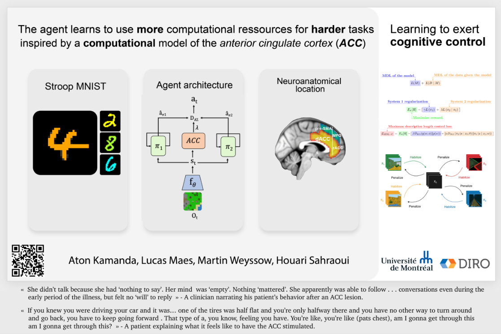

# dualp
Master thesis on adaptive computational strategy based on dual process theory (System1/System2) for deep neural networks this work was presented at MAIN 2022, the complete thesis is available [here](thesis/master_thesis.pdf). 

